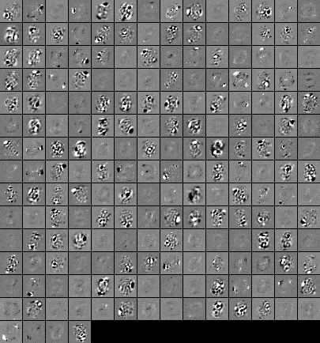

CharRecog
=========
ニューラルネットを使った文字認識エンジンです。  



動作条件
--------
OS : Windows 7 またはそれ以上、64 ビット版  
（ソースからは 32 ビット版をビルドすることもできます。）

RAM : 8GB 以上

まず動かしてみたい方へ（MNIST画像セットの学習）
----------------------------------------
1. GitHub からローカルにモジュール一式をダウンロードします。
```
git clone https://github.com/kensak/CharRecog.git
```

2. [THE MNIST DATABASE of handwritten digits のサイト](http://yann.lecun.com/exdb/mnist/)
から 4 つのデータファイルをダウンロードし、解凍してから `data\MNIST` フォルダーに置きます。

3. 同じフォルダーにある `run.bat` を実行すると、`MNIST_test_data` と `MNIST_train_data` というフォルダーができ、
png 形式の文字画像が書き込まれます。

4. ルートにある `demo-MNIST.bat` を実行すると学習が始まります。
200 回ループし、10 ループごとに学習セットと評価セットでの認識率を計算します。
学習が終了すると、3 つのパーセプトロン・レイヤーの重み情報を画像にして出力します。
ネットワークの情報は `NN_params.bin` に出力され、文字認識に使用できます。  
例えば、
```
bin64\CharRecog.exe -v -b -h 28 -w 28 TEST data\MNIST\MNIST_test_data
```
を実行すると、評価セットの認識率を再び計算します。

特徴
----
+ 並列処理 : インテル TBB、OpenMP, C++ AMP などを使い、マルチコア CPU や GPU による並列処理をおこなっています。
+ 行列計算による高速化 : すべてのサンプル画像を処理する際、できるだけループを回さず一回の行列計算により処理をおこないます。
+ さまざまな手法への対応 : autoencoding, convolutional layer, max pooling, maxout, dropout の各手法や
  入力画像のランダムな affine 変換などに対応しています。
+ ビルド済み実行ファイルでは float で計算をおこないますが、ソースを一ヶ所変更してリビルドすれば double にも対応します。
+ 学習された重みを画像として出力できます。
 
パラメータの解説
--------------
`doc` フォルダーにあるマニュアルをご覧ください。
 
 ビルドの方法
-----------
[`src\README.md`](./src/README.md) をご覧ください。

ライセンス
--------
[MIT ライセンス][MIT] と [GPL v2 ライセンス][GPL] のデュアル・ライセンスにより配布しています。

榊原　研  
Email: ken.sakakibar@gmail.com  
Blog: [http://kensak.github.io/](http://kensak.github.io/)  
GitHub: [https://github.com/kensak](https://github.com/kensak)  
Twitter: KenSakakibar

[MIT]: http://www.opensource.org/licenses/mit-license.php
[GPL]: http://www.gnu.org/licenses/gpl.html