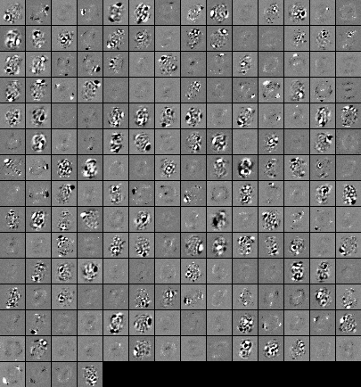

CharRecog
=========
CharRecog is a character recognition engine. It is designed so as to test various models and  settings of neural networks.



Operating Conditions
----------------
OS : Windows 7 and above, 64 bit version  
(You can build a 32 bit executable from the source.)

RAM : more than 8GB

Quick Start (training by MNIST image set)
----------------------------------------
1. Download CharRecog from the GitHub site:
```
git clone https://github.com/kensak/CharRecog.git
```

2. Download 4 data files from ["THE MNIST DATABASE of handwritten digits" site](http://yann.lecun.com/exdb/mnist/),
uncompress and put them in `data\MNIST` folder.

3. Execute `run.bat` in the same folder. This will create two sub-folders `MNIST_test_data` and `MNIST_train_data`,
and inside them you will find PNG image files.

4. `demo-MNIST.bat` in the root folder will start training the network.
It iterates for 200 times, and the recognition rate of both the training and testing set will be calculated every 10 loops.
After the training, the weights of three perceptron layers will be written down as image files.
The parameters of the network will be written in `NN_maxout.bin` and is ready for further prediction tasks.
For example, the command line
```
bin64\CharRecog.exe -v -b -h 28 -w 28 -p NN_maxout.bin TEST data\MNIST\MNIST_test_data
```
will start the recalculation of the recognition rate for the testing set.

Features
-------
+ Parallel processing : CharRecog exploits multi-core CPUs and GPUs for speeding up,
  by paralellizing the processing through Intel TBBÅAOpenMP and C++ AMP.
+ Matrix operations instead of loops : whenever possible, CharRecog makes use of matrix calculations insted of loops.
+ Support of new technologies : CharRecog supports new NN technologies such as autoencoding,
  convolutional layer, max pooling, maxout, dropout, random affine tranformation of input images.
+ Capability of 'double' calculations : the included exe does (almost) all the calculations in float.
  You can enable the calculations in double by modifying one line in the source code and rebuilding.
+ Weight image output : you can output the weights of a perceptron or convolution layer as an image file.
 
Command Options
--------------
Refer to the manual in `doc` folder.
 
How To Build
-----------
Refer to: [`src\README_en.md`](./src/README_en.md).

License
-------
Dual licensed under the [MIT license][MIT] and [GPL v2 license][GPL].

Ken Sakakibara  
Email: ken.sakakibar@gmail.com  
Blog: [http://kensak.github.io/](http://kensak.github.io/)  
GitHub: [https://github.com/kensak](https://github.com/kensak)  
Twitter: KenSakakibar

[MIT]: http://www.opensource.org/licenses/mit-license.php
[GPL]: http://www.gnu.org/licenses/gpl.html